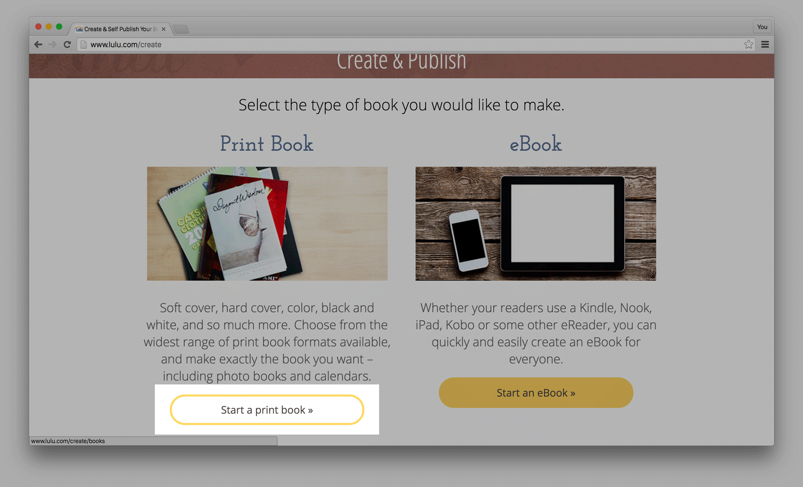
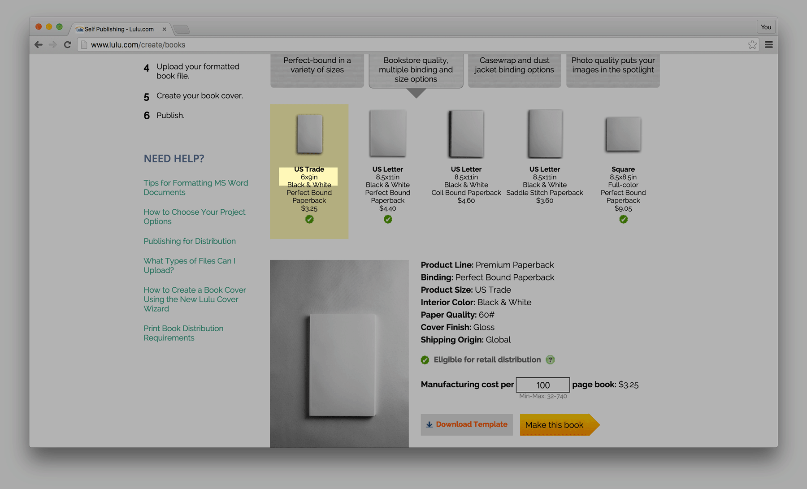
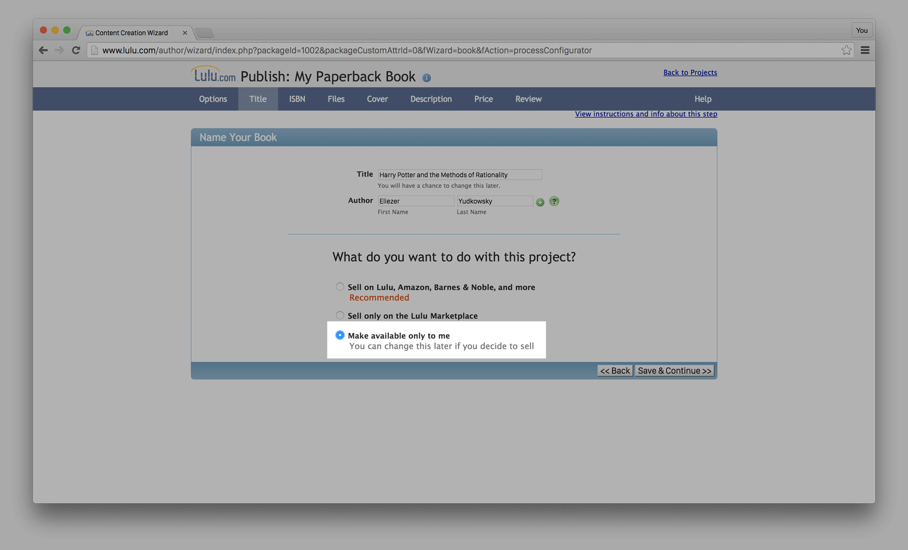
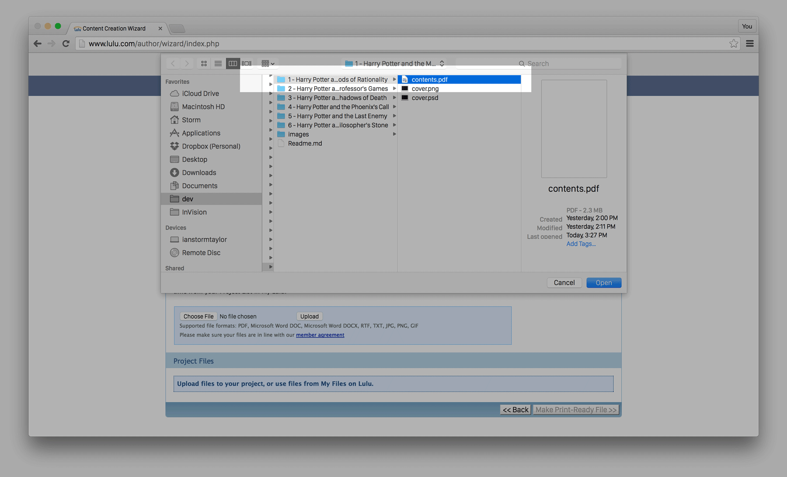
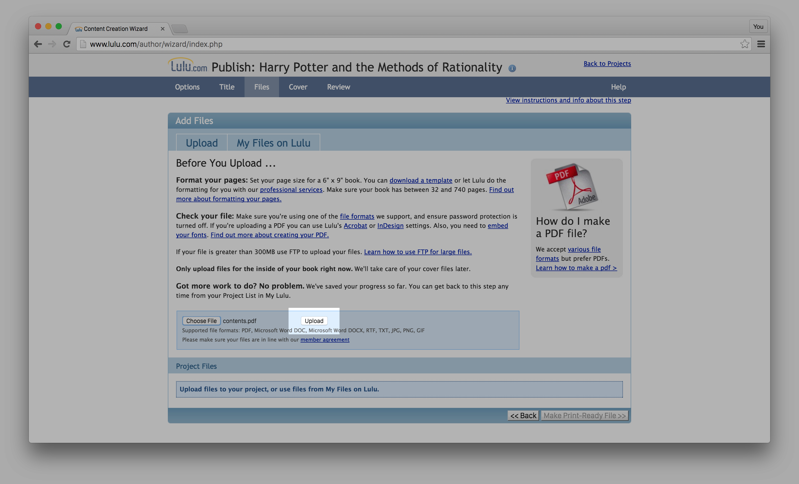
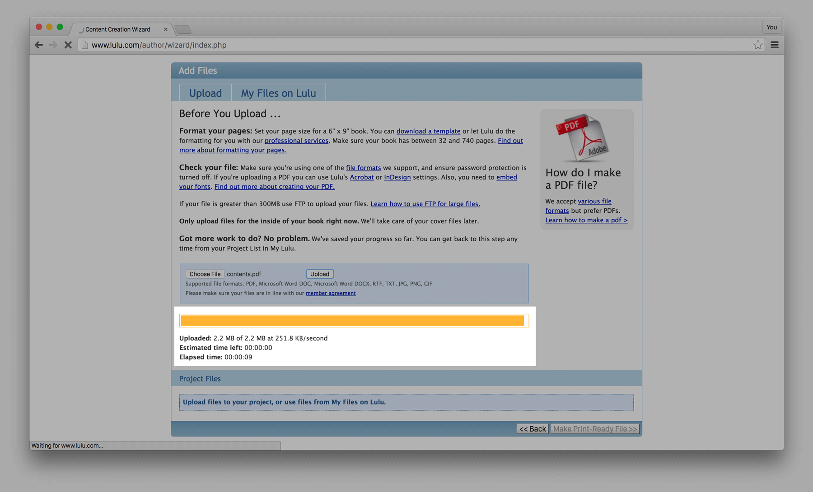
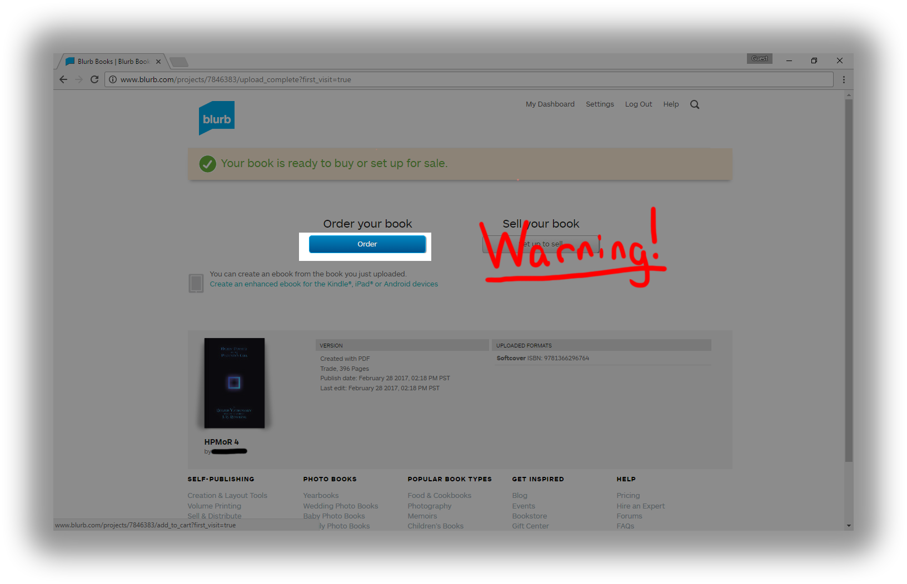

# Instructions

To get your own hard copies of each of the Harry Potter and the Methods of Rationality volumes, I'll walk you through how to print them with Blurb. We're not going to use Blurb's "Sell My Book" feature, so that the books are only visible to you, this way you aren't violating any copyright laws by "profiting" off of the works. (Don't worry, it's easy!)

To start, download a copy of this repository as a **ZIP** file, and extract it somewhere on your computer.

You should end up with a folder that contains subfolders with the resources needed to create each volume. We'll use these files during the Blurb book creation process.

If you don't have one already, you'll need to create your own Blurb account.

Then, on the homepage, click **Get Started**.

And then, select **Trade Books**, then select **6x9 in, 15x23cm** as the size. Finally, click **Create and Upload Your PDF**

Click **Upload PDF.**

Upload cover and pages as seperate files. Click choose file for each of the requested files and navigate to where you extracted the files on your computer. Put the cover.pdf in and contents.pdf in their respective sections by selecting "Open."

- Select soft cover
- Choose Economy B&W. You may decide if you want cream or white colored pages (I prefer cream)
- Select Blurb's Free ISBN. You have to get an ISBN for your book because this is how Blurb tracks their online book orders.
- Choose a book title for you to identify your book for yourself.
- Choose author name. I just put Eliezer Yudkowsky in the file, but I don't think it matters.
- Click Upload to blurb.

After the website checks the PDFs for errors, it should bring you to this screen after doing a preflight.
Click Preview Book.

You can check the cover and pages if you would like.
Scroll down and click order book.

Click order to buy the book. 

**WARNING:** to not select to "Set up to Sell" as doing this would be profiting off of Rowling's Intellectual Property and is **Illegal** not to mention that Blurb would stop printing these books for everyone.

I recomend not paying the five dollars for Blurb to automatically create an E-Book in the order screen, as there is a perfectly good E-Book version [here](http://hpmor.com/).

...and there you have it! You can either continue making a book for each other volume in the series and add them to your cart too, or, if you haven't read the series yet, you can just order the first volume and see if you like it first!

Have fun!
