# Instructions

To get your own hard copies of each of the Harry Potter and the Methods of Rationality volumes, I'll walk you through how to print them with Lulu. We're going to use Lulu's "private" feature, so that the books are only visible to you, so that you aren't violating any copyright laws by "profiting" off of the works. (Don't worry, it's easy!)

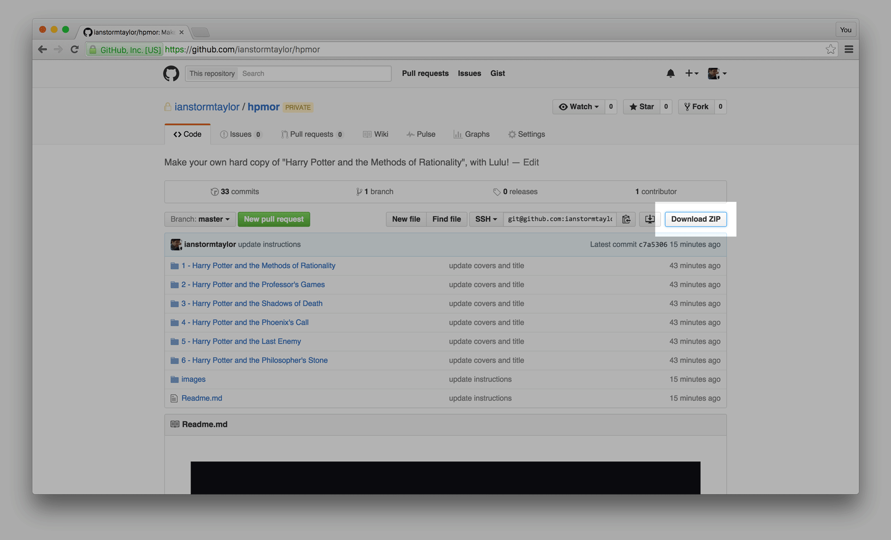

To start, download a copy of this repository as a **ZIP** file, and extract it somewhere on your computer.

You should end up with a folder that contains subfolders with the resources needed to create each volume. We'll use these files during the Lulu book creation process.

If you don't have one already, you'll need to create your own Lulu account.

Then, on the homepage, click **Create**.

And then, click to **Start a print book**.

Select the **Premium 6" x 9"** book, and then click **Make this book**. Note, the covers are designed from books with **Premium** paper, since the paper quality changes the thickness of the spine. You can still go with **Standard** to reduce the cost slightly, but the cover might be a few extra millimeters off. 

Then enter the title and author information you want, which is only useful for keeping track yourself, since no one else will ever see it. Make sure to select **Make available only to me** so that you aren't violating copyright! That's critical.

Next you need to hit **Choose File**...

... and **Open** the `contents.pdf` from the `1 - Harry Potter and the Methods of Reality` folder, which contains all of the innards of the first volume of the series.

Then hit **Upload**...

...wait for the upload to complete...

...and once it has, click **Make Print-Ready File**.

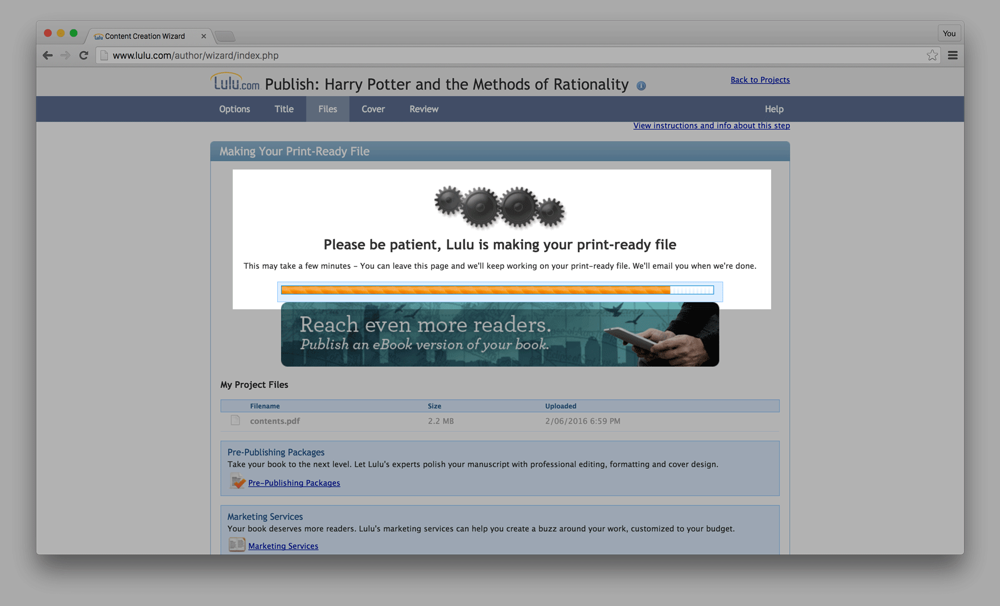

Lulu will need to process the file before we can continue, so it can calculate things like the spine's width based on the number of pages. (All of the cover images are already designed to take the spine widths of each book into mind!)

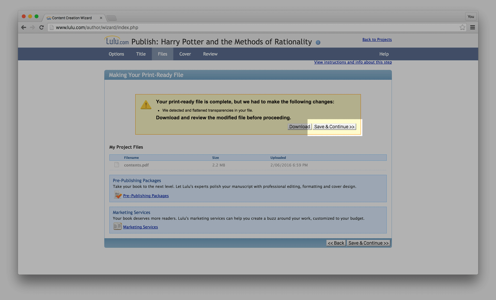

Once that is done, hit **Save & Continue**.

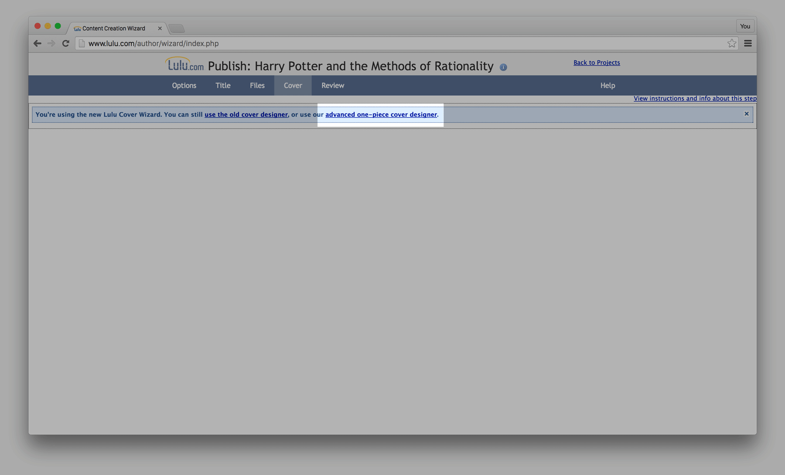

The "normal" cover designer will start to load, but you want to use the **advanced one-piece cover designer** instead, which lets us you upload a single image file for the entire cover, meaning that we can design the spine as well. So click that...

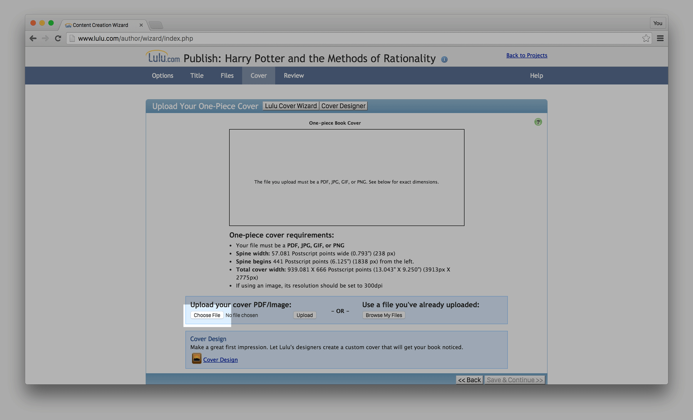

...and then **Choose File**...

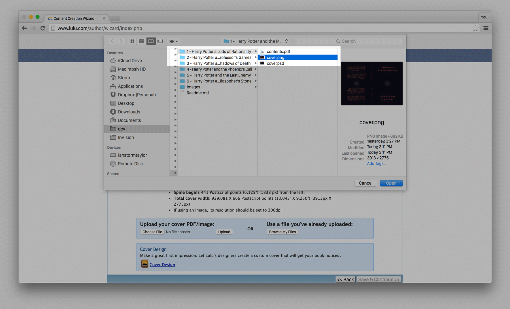

...and select the `cover.png` from the same `1 - Harry Potter and the Methods of Reality` folder, and hit **Open**.

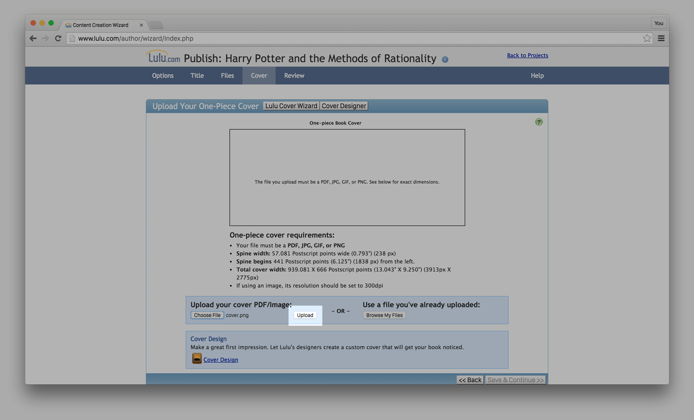

Then hit **Upload**...

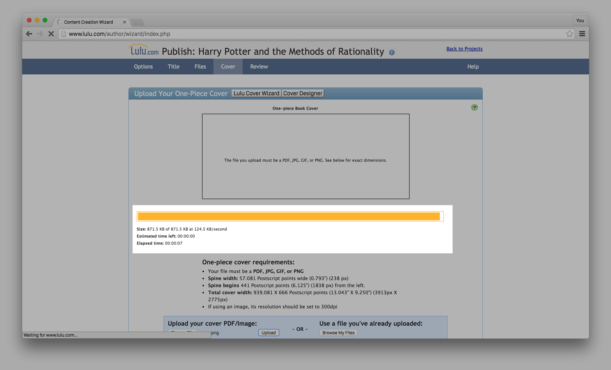

...and wait for the upload to complete.

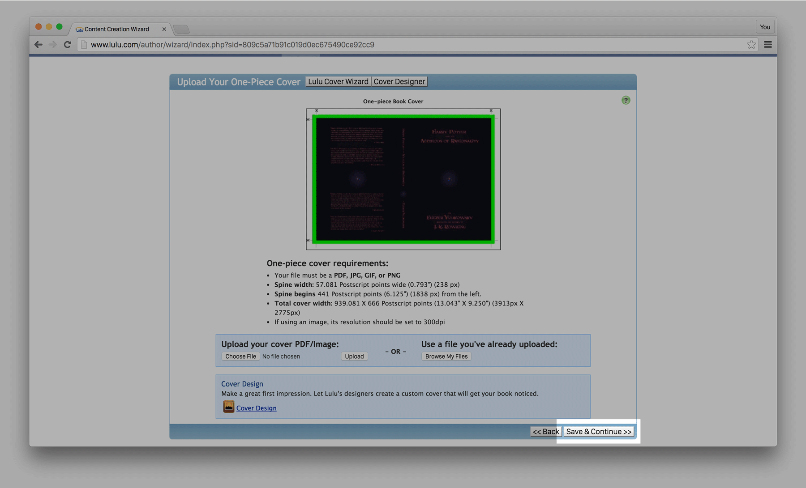

Once it has, you should see the cover image. Hit **Save & Continue**...

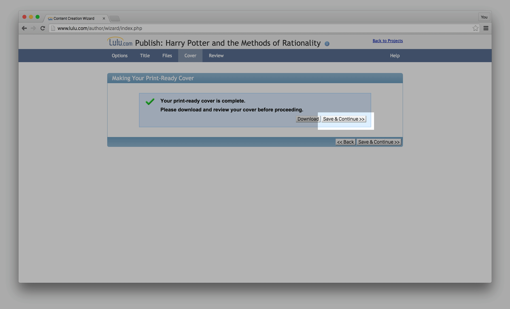

...and **Save & Continue** again...

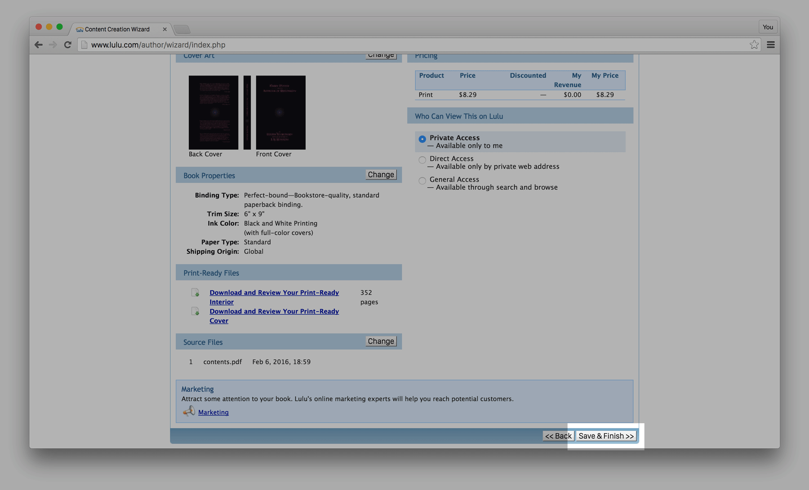

...and then **Save & Finish**...

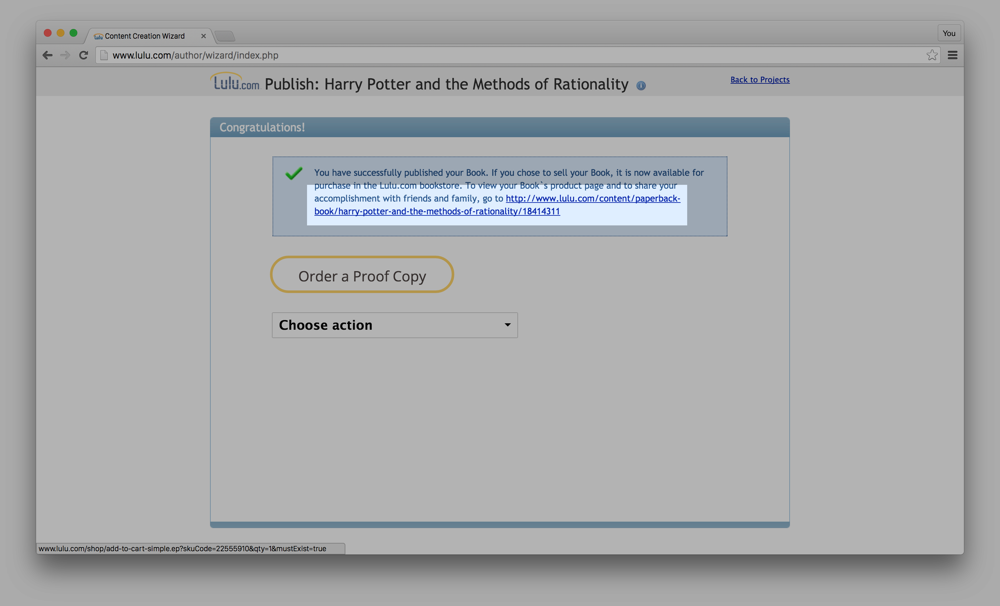

...and the book is complete! Now you can click that long URL to see it.

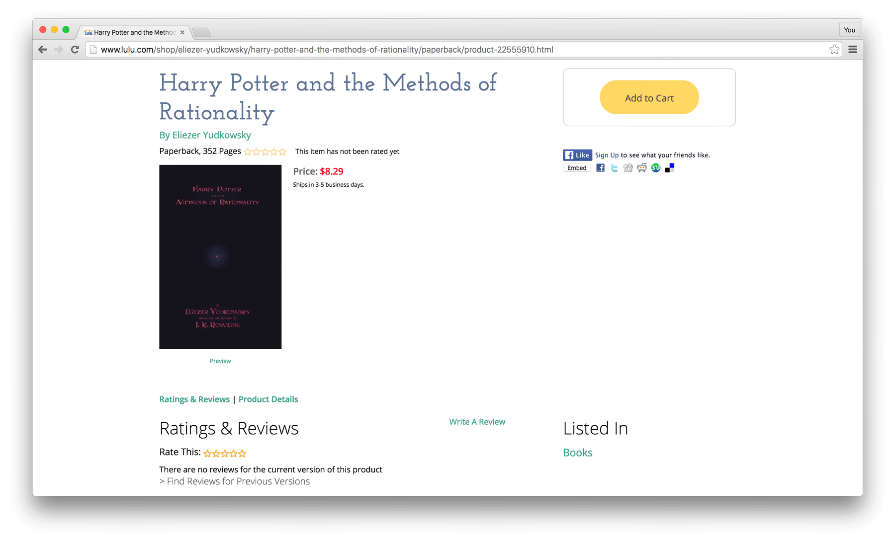

There it is. Now all you need to do is **Add to Cart**... 

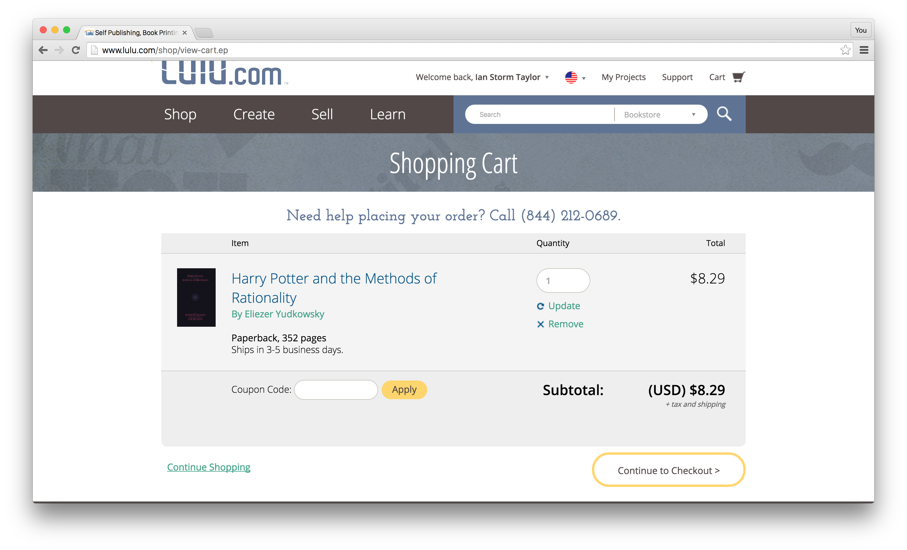

...and there you have it! You can either continue making a book for each other volume in the series and add them to your cart too, or, if you haven't read the series yet, you can just order the first volume and see if you like it first!

Have fun!
