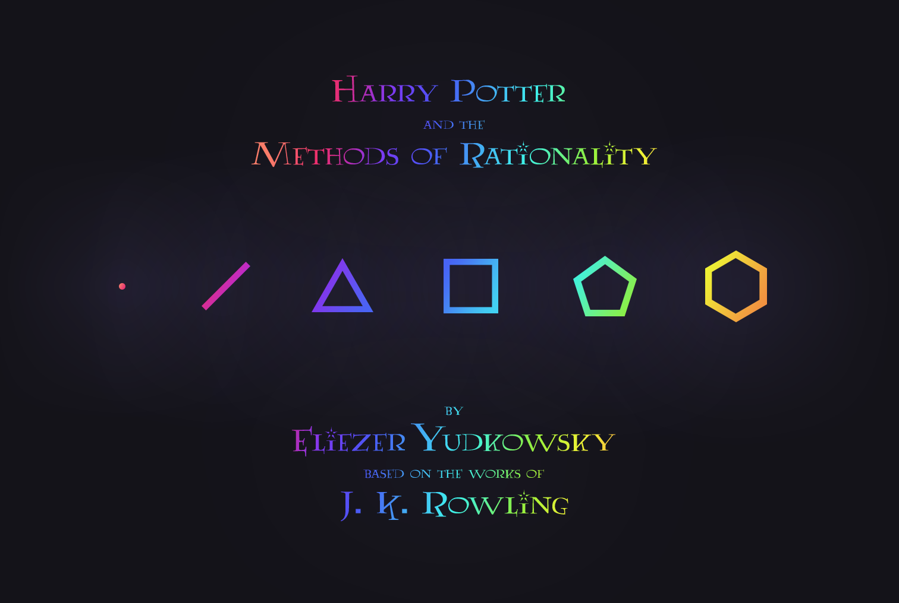

This repository contains everything you need to make your own real-life, hard copies of every volume of _[Harry Potter and the Methods of Rationality](http://hpmor.com/)_ with [Lulu](http://www.lulu.com/)! 

Eliezer Yudkowsky, or anyone else, isn't allowed to sell the book, because it's based on J. K. Rowling's copyrighted universe of characters. But, you _can_ create your own private copy of the book with Lulu, a service that prints books on demand, and then order yourself a proof copy. That way, you can experience it on paper!

Want an ebook? Then you don't need this repository! Because that's [already officially supported](http://hpmor.com/).

## Table of Contents

- [Table of Contents](#table-of-contents)
- [Praise](#praise)
- [Volumes](#volumes)
- [Instructions](#instructions)
- [Thanks](#thanks)


## Praise

> "Harry Potter and the Methods of Rationality poses an alternate world in which Harry is a genius. ... It's a terrific series, subtle and dramatic and stimulating. Yudkowsky gets it, and lots else. Smart guy, good writer. Poses hugely terrific questions that I, too, had thought of... and a number that I hadn't. Enjoyed all references to the Enlightenment. I wish all Potter fans would go here, and try on a bigger, bolder and more challenging tale."
> —[David Brin](http://davidbrin.blogspot.com/2010/06/secret-of-college-life-plus.html)

> "Oh Thoth Trismegistus, oh Ma'at, oh Ganesha, oh sweet lady Eris... I have not laughed so hard in years! ... Read it and laugh. Read it and learn. Eliezer re-invents Harry Potter as a skeptic genius who sets himself the task of figuring out just how all this "magic" stuff works. Strongly recommended. And if you manage to learn about sources of cognitive bias like the Planning Fallacy and the Bystander Effect, among others, while your sides are hurting with laughter, so much the better."
> —[Eric S. Raymond](http://esr.ibiblio.org/?p=2100)

> "Harry Potter and the Methods of Rationality is the sort of thing that would technically be called a fanfic, but is more appropriately named a work of sheer genius. It takes the basic Harry Potter story and asks, "what if, instead of a boy locked in a closet, he was a child genius raised by a loving pair of adoptive parents who brought science, reason, and modern thinking to the wizarding world?" ... LOVE. IT. Read it, seriously. It will change your way of looking at the world."
> —[Rachel Aaron](http://civilian-reader.blogspot.com/2011/05/interview-with-rachel-aaron.html)

> "This is a book whose title still makes me laugh and yet it may just turn out to be one of the greatest books ever written. The writing is shockingly good, the plotting is some of the best in all of literature, and the stories are simply pure genius. I fear this book may never get the accoldaes it deserves, because it's too hard to look past the silly name and publishing model, but I hope you, dear reader, are wiser than that! A must-read."
> —[Aaron Swartz](http://www.aaronsw.com/weblog/books2011)


## Volumes


> Every inch of wall space is covered by a bookcase. Each bookcase has six shelves, going almost to the ceiling. Some bookshelves are stacked to the brim with hardback books: science, maths, history, and everything else. Other shelves have to layers of paperback science fiction, with the back layer of books propps up on old tissue boxes or lengths of...

```yaml
Title: Harry Potter and the Methods of Rationality
Pages: 352
Size: 6" x 9"
Weight: 1.30 lbs.
Price: $5.98 (Standard), $8.29 (Premium)
```


> A small study room, near but not in the Ravenclaw dorm, one of the many many unused rooms of Hogwarts. Gray stone the floors, red brick the walls, dark stained wood the ceiling, four glowing glass globes set into the four walls of the room. A circular table that looked like a wide slab of black marble set on thick black marble legs for columns, but...

```yaml
Title: Harry Potter and the Professor's Games
Pages: 288 
Size: 6" x 9"
Weight: 1.08 lbs.
Price: $5.08 (Standard), $7.01 (Premium)
```


> Bright the sun, bright the air, bright the students and bright their parents, clean the paved ground of Platform 9.75, the winter Sun hanging low in the sky at 9:45AM in the morning on January 5th, 1992. Some of the younger students wore scarves and mittens, but most simply wore their robes; they were wizards, after all. After Harry had moved away from...

```yaml
Title: Harry Potter and the Shadows of Death
Pages: 398 
Size: 6" x 9"
Weight: 1.46 lbs.
Price: $6.62 (Standard), $9.21 (Premium)
```


> Hermione Granger had read somewhere once, that one of the keys to staying thing was to pay attention to the food you ate, to notice yourself eating it, so that you were satisfied with the meal. This morning she'd made herself toast, and put butter on the toast, and cinnamon on the butter, and it really should've been enough to get her to _notice_...

```yaml
Title: Harry Potter and the Phoenix's Call
Pages: 394
Size: 6" x 9"
Weight: 1.44 lbs.
Price: $6.57 (Standard), $9.13 (Premium)
```


> The four of them gathered once more around the ancient desk of the Headmaster of Hogwarts, with its drawers within drawers within drawers, wherein all the past paperwork of the Hogwarts School was stored; legend had it that Headmistress Shehla had once gotten lost in that desk, and was, in fact, still there, and wouldn't be let out again until...

```yaml
Title: Harry Potter and the Last Enemy
Pages: 232
Size: 6" x 9"
Weight: 0.89 lbs.
Price: $4.30 (Standard), $5.89 (Premium)
```


> May 13th, 1992. Argus Filch's face appeared twisted in the light of the oil lamp he held, shadows dancing over his face. Behind them the doors of Hogwarts quickly receded, and the dark grounds moved closer. The track they now walked was muddy and indistinct. The trees, branches formerly bare with winter, were not fully clad with spring; their...

```yaml
Title: Harry Potter and the Philosopher's Stone
Pages: 322
Size: 6" x 9"
Weight: 1.20 lbs.
Price: $5.56 (Standard), $7.69 (Premium)
```


## Instructions

TODO


## Thanks

Thanks to [J. K. Rowling](https://en.wikipedia.org/wiki/J._K._Rowling) for creating the entire [Harry Potter](https://en.wikipedia.org/wiki/Harry_Potter) universe, characters, etc. and to [Eliezer Yudkowsky](https://en.wikipedia.org/wiki/Eliezer_Yudkowsky) for writing [Harry Potter and the Methods of Rationality](https://en.wikipedia.org/wiki/Harry_Potter_and_the_Methods_of_Rationality).
